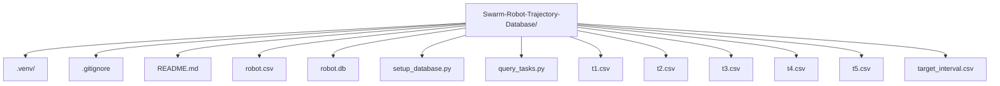

# Swarm Robot Trajectory Database

CSCI4333 Database Project for analyzing swarm robot trajectories. This project involves designing a relational database, populating it with data from CSV files, and performing SQL-based analysis to understand robot behavior.

## Project Overview

Swarm robots are small, autonomous robots crucial for tasks like resource foraging. Ensuring their proper functioning is vital. This project aims to build a data analysis system to help detect potential issues by analyzing robot trajectory data.

**Data Files Provided:**

1.  `robot.csv`: Contains robot ID and name.
    ```
    1,Astro
    2,IamHuman
    3,MoonLander
    4,Wonderlust
    5,Challenger
    ```
2.  `t[1-5].csv`: Trajectory data for each robot (robot `i` corresponds to `ti.csv`). Each row represents `x_coord,y_coord` at a specific timestamp (row number, starting from 1).
3.  `target_interval.csv`: Defines time intervals of interest with start time, end time, and event type.
    ```csv
    start_time,end_time,event_type
    5000,5300,unknown
    3000,3800,unknown
    6000,6500,normal
    ```

## Task 1: ER Diagram and Relational Schema

UPLOADED TO BLACKBOARD

Design Rationale: The schema normalizes the data by creating separate tables for robots, their trajectories, and target intervals. This allows for efficient querying and data integrity. The Trajectories table includes foreign keys to link back to the Robots table and a unique constraint on (robot_id, timestamp).
Task 2: Database Creation and Data Import
An SQLite database named robot.db is created and populated using the setup_database.py Python script. This script:
Creates the tables defined in the schema.
Imports data from robot.csv into the Robots table.
Imports data from t1.csv through t5.csv into the Trajectories table, assigning robot_id based on the file number and calculating timestamps based on row number.
Imports data from target_interval.csv into the TargetIntervals table.
Confirmation of Task 2 Execution (Sample Console Output from setup_database.py):
Removed existing database robot.db.
Tables created successfully.
Robot data from ./robot.csv imported successfully.
Trajectory data from ./t1.csv imported successfully.
Trajectory data from ./t2.csv imported successfully.
Trajectory data from ./t3.csv imported successfully.
Trajectory data from ./t4.csv imported successfully.
Trajectory data from ./t5.csv imported successfully.
All trajectory data imported.
Target interval data from ./target_interval.csv imported successfully.
Database robot.db created and populated successfully.

The primary deliverable for this task is the robot.db file and the setup_database.py script.
Task 3 & 4: SQL Queries and Analysis Results
The following output is generated by running the query_tasks.py script, which connects to the populated robot.db database.
(The dyld messages related to OpenGL are system-level warnings on macOS and can be ignored for this project's functionality.)
========== TASK 3: META-INFO QUERIES ==========

--- 1. Robot Names with Max/Min X-axis ---
SQL Query: SELECT
            r.name AS robot_name,
            MAX(t.x_coord) AS max_x_reached,
            MIN(t.x_coord) AS min_x_reached
        FROM
            Robots r
        JOIN
            Trajectories t ON r.robot_id = t.robot_id
        GROUP BY
            r.name
        ORDER BY
            r.name;
Results:
['robot_name', 'max_x_reached', 'min_x_reached']
('Astro', 145.0, -4.7466)
('Challenger', 382.31, -192.93)
('IamHuman', 233.38, -6.8667)
('MoonLander', 145.0, -190.85)
('Wonderlust', 380.8, -380.93)
----------------------------------------------

--- 2. Robot Names with Max/Min Y-axis ---
SQL Query: SELECT
            r.name AS robot_name,
            MAX(t.y_coord) AS max_y_reached,
            MIN(t.y_coord) AS min_y_reached
        FROM
            Robots r
        JOIN
            Trajectories t ON r.robot_id = t.robot_id
        GROUP BY
            r.name
        ORDER BY
            r.name;
Results:
['robot_name', 'max_y_reached', 'min_y_reached']
('Astro', 175.8, 0.41976)
('Challenger', 382.67, -380.72)
('IamHuman', 195.1, -0.72259)
('MoonLander', 163.13, 6.9552)
('Wonderlust', 130.0, -380.87)
----------------------------------------------

========== TASK 4: TRAJECTORY ANALYSIS ==========

--- 1. Regions where Astro and IamHuman are close ---
SQL Query: WITH CloseTimestamps AS (
        SELECT
            t_astro.timestamp,
            t_astro.x_coord AS astro_x,
            t_astro.y_coord AS astro_y,
            t_human.x_coord AS human_x,
            t_human.y_coord AS human_y
        FROM
            Trajectories t_astro
        JOIN
            Robots r_astro ON t_astro.robot_id = r_astro.robot_id
        JOIN
            Trajectories t_human ON t_astro.timestamp = t_human.timestamp
        JOIN
            Robots r_human ON t_human.robot_id = r_human.robot_id
        WHERE
            r_astro.name = 'Astro' AND r_human.name = 'IamHuman'
            AND t_astro.robot_id != t_human.robot_id
            AND ABS(t_astro.x_coord - t_human.x_coord) < 1
            AND ABS(t_astro.y_coord - t_human.y_coord) < 1
    ),
    GroupedCloseEvents AS (
        SELECT
            timestamp,
            astro_x,
            astro_y,
            timestamp - ROW_NUMBER() OVER (ORDER BY timestamp) as grp
        FROM CloseTimestamps
    )
    SELECT
        MIN(timestamp) AS region_start_time,
        MAX(timestamp) AS region_end_time,
        MIN(astro_x) AS astro_region_x_min,
        MAX(astro_x) AS astro_region_x_max,
        MIN(astro_y) AS astro_region_y_min,
        MAX(astro_y) AS astro_region_y_max
    FROM GroupedCloseEvents
    GROUP BY grp
    ORDER BY region_start_time;
Results:
['region_start_time', 'region_end_time', 'astro_region_x_min', 'astro_region_x_max', 'astro_region_y_min', 'astro_region_y_max']
(1, 42, 145.0, 145.0, 130.0, 130.0)
---------------------------------------------------------

--- 2. Duration (secs) Astro and IamHuman are close ---
SQL Query: SELECT
            COUNT(DISTINCT t_astro.timestamp) AS total_close_duration_secs
        FROM
            Trajectories t_astro
        JOIN
            Robots r_astro ON t_astro.robot_id = r_astro.robot_id
        JOIN
            Trajectories t_human ON t_astro.timestamp = t_human.timestamp
        JOIN
            Robots r_human ON t_human.robot_id = r_human.robot_id
        WHERE
            r_astro.name = 'Astro' AND r_human.name = 'IamHuman'
            AND t_astro.robot_id != t_human.robot_id
            AND ABS(t_astro.x_coord - t_human.x_coord) < 1
            AND ABS(t_astro.y_coord - t_human.y_coord) < 1;
Results:
['total_close_duration_secs']
(42,)
-----------------------------------------------------------

========== TASK 4 (BONUS): AVERAGE ROBOT MOVING SPEED ==========
Interval ID | Event Type | Robot Name | Avg Speed (cm/s)          | Is Slower (<0.2 cm/s)?
---------------------------------------------------------------------------------
1           | unknown    | Astro      | 0.0333                    | Yes
1           | unknown    | IamHuman   | 0.3895                    | No
1           | unknown    | MoonLander | 0.1400                    | Yes
1           | unknown    | Wonderlust | 0.4789                    | No
1           | unknown    | Challenger | 0.1184                    | Yes
2           | unknown    | Astro      | 0.4190                    | No
2           | unknown    | IamHuman   | 0.2775                    | No
2           | unknown    | MoonLander | 0.2869                    | No
2           | unknown    | Wonderlust | 0.3507                    | No
2           | unknown    | Challenger | 0.3829                    | No
3           | normal     | Astro      | 0.3043                    | No
3           | normal     | IamHuman   | 0.3523                    | No
3           | normal     | MoonLander | 0.4060                    | No
3           | normal     | Wonderlust | 0.0790                    | Yes
3           | normal     | Challenger | 0.3930                    | No
---------------------------------------------------------------------------------

### 📁 Project Structure




How to Run
Prerequisites:
Python 3
SQLite3 (usually comes with Python)
Setup Instructions:
Clone the repository or place all files in a single project directory.
setup_database.py
query_tasks.py
All .csv files (robot.csv, t1.csv-t5.csv, target_interval.csv)
Open your terminal or command prompt and navigate to the project directory.
(Optional but Recommended) Create and activate a Python virtual environment:
On macOS/Linux:
python3 -m venv .venv
source .venv/bin/activate

On Windows:
python -m venv .venv
.venv\Scripts\activate

Run the database setup script:
This will create robot.db and populate it.
python3 setup_database.py

(Use python instead of python3 if that's how your system is configured, especially on Windows.)
Run the query and analysis script:
This will print the results of Tasks 3 & 4 to the console.
python3 query_tasks.py

